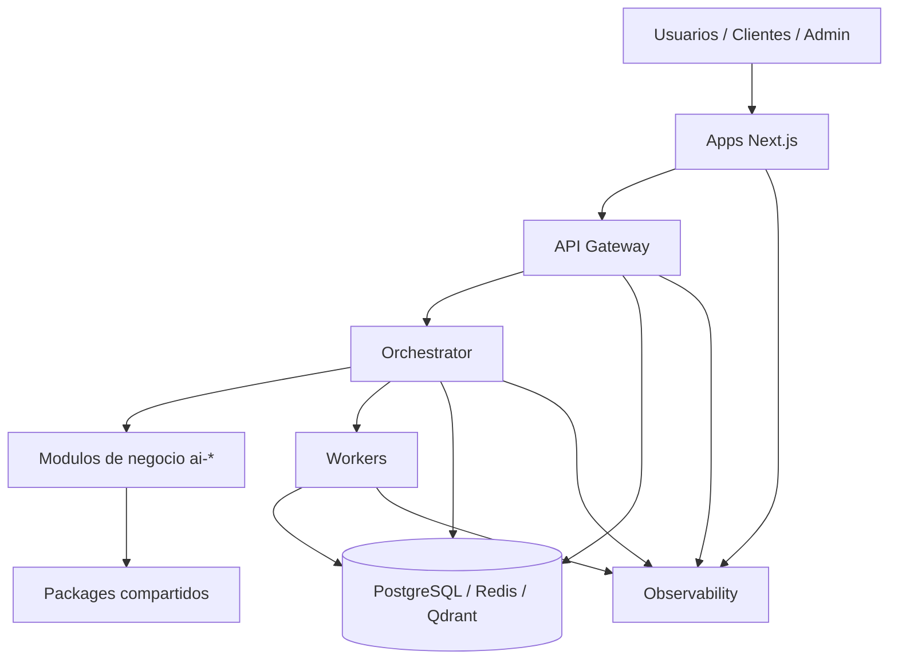
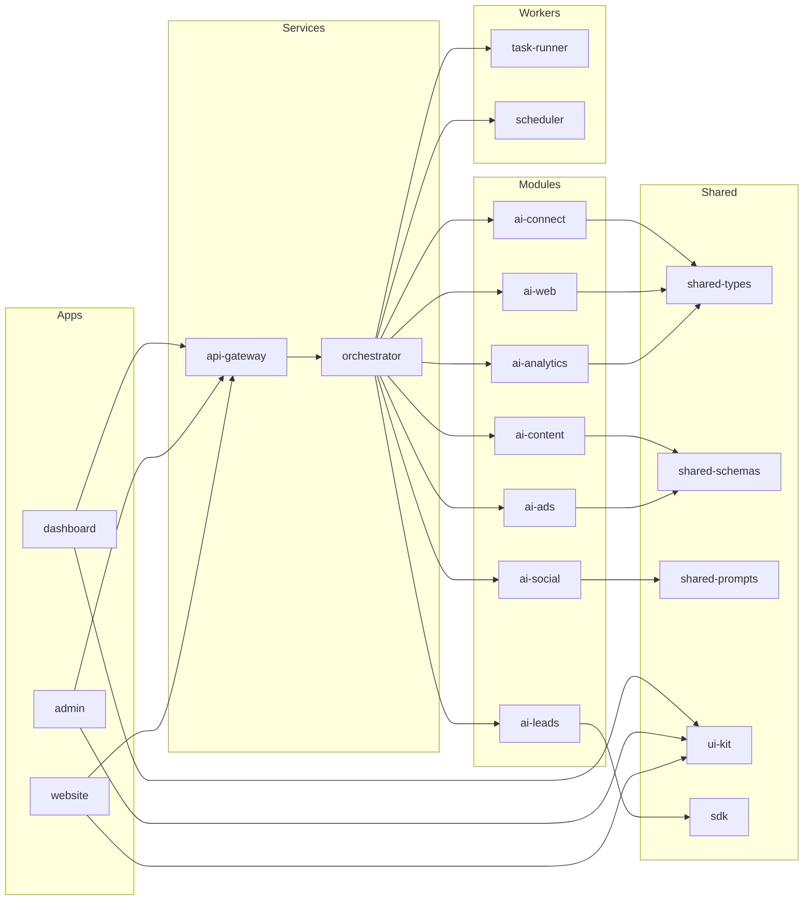

# Diagrama de Estructura Fase 1

## Vista de alto nivel



## Estructura completa del repositorio

```text
ai-platform/
├── .env.example
├── .gitignore
├── package.json
├── pnpm-workspace.yaml
├── README.md
├── tsconfig.base.json
├── turbo.json
│
├── apps/
│   ├── admin/
│   │   ├── app/
│   │   │   ├── layout.tsx
│   │   │   └── page.tsx
│   │   ├── next.config.mjs
│   │   ├── package.json
│   │   └── tsconfig.json
│   ├── dashboard/
│   │   ├── app/
│   │   │   ├── layout.tsx
│   │   │   └── page.tsx
│   │   ├── next.config.mjs
│   │   ├── package.json
│   │   └── tsconfig.json
│   └── website/
│       ├── app/
│       │   ├── layout.tsx
│       │   └── page.tsx
│       ├── next.config.mjs
│       ├── package.json
│       └── tsconfig.json
│
├── docs/
│   ├── architecture.md
│   ├── adr/
│   │   ├── ADR-001-monorepo.md
│   │   └── ADR-002-multi-tenancy.md
│   ├── diagrams/
│   │   └── fase-1-structure.md
│   ├── reports/
│   │   └── 2026-04-16-architecture-refactor-report.md
│   └── runbooks/
│       └── development.md
│
├── infra/
│   ├── ci/
│   │   └── github-actions/
│   │       └── ci.yml
│   ├── compose/
│   │   └── docker-compose.dev.yml
│   ├── docker/
│   │   └── README.md
│   └── k8s/
│       └── base/
│           └── namespace.yaml
│
├── modules/
│   ├── ai-ads/
│   │   ├── README.md
│   │   ├── application/
│   │   │   └── handler.py
│   │   ├── contracts/
│   │   │   └── README.md
│   │   ├── domain/
│   │   │   └── README.md
│   │   ├── infrastructure/
│   │   │   └── README.md
│   │   ├── prompts/
│   │   │   └── system.txt
│   │   ├── tests/
│   │   │   └── test_module.py
│   │   └── tools/
│   │       └── README.md
│   ├── ai-analytics/
│   │   ├── README.md
│   │   ├── application/
│   │   │   └── handler.py
│   │   ├── contracts/
│   │   │   └── README.md
│   │   ├── domain/
│   │   │   └── README.md
│   │   ├── infrastructure/
│   │   │   └── README.md
│   │   ├── prompts/
│   │   │   └── system.txt
│   │   ├── tests/
│   │   │   └── test_module.py
│   │   └── tools/
│   │       └── README.md
│   ├── ai-connect/
│   │   ├── README.md
│   │   ├── application/
│   │   │   └── handler.py
│   │   ├── contracts/
│   │   │   └── README.md
│   │   ├── domain/
│   │   │   └── README.md
│   │   ├── infrastructure/
│   │   │   └── README.md
│   │   ├── prompts/
│   │   │   └── system.txt
│   │   ├── tests/
│   │   │   └── test_module.py
│   │   └── tools/
│   │       └── README.md
│   ├── ai-content/
│   │   ├── README.md
│   │   ├── application/
│   │   │   └── handler.py
│   │   ├── contracts/
│   │   │   └── README.md
│   │   ├── domain/
│   │   │   └── README.md
│   │   ├── infrastructure/
│   │   │   └── README.md
│   │   ├── prompts/
│   │   │   └── system.txt
│   │   ├── tests/
│   │   │   └── test_module.py
│   │   └── tools/
│   │       └── README.md
│   ├── ai-leads/
│   │   ├── README.md
│   │   ├── application/
│   │   │   └── handler.py
│   │   ├── contracts/
│   │   │   └── README.md
│   │   ├── domain/
│   │   │   └── README.md
│   │   ├── infrastructure/
│   │   │   └── README.md
│   │   ├── prompts/
│   │   │   └── system.txt
│   │   ├── tests/
│   │   │   └── test_module.py
│   │   └── tools/
│   │       └── README.md
│   ├── ai-social/
│   │   ├── README.md
│   │   ├── application/
│   │   │   └── handler.py
│   │   ├── contracts/
│   │   │   └── README.md
│   │   ├── domain/
│   │   │   └── README.md
│   │   ├── infrastructure/
│   │   │   └── README.md
│   │   ├── prompts/
│   │   │   └── system.txt
│   │   ├── tests/
│   │   │   └── test_module.py
│   │   └── tools/
│   │       └── README.md
│   └── ai-web/
│       ├── README.md
│       ├── application/
│       │   └── handler.py
│       ├── contracts/
│       │   └── README.md
│       ├── domain/
│       │   └── README.md
│       ├── infrastructure/
│       │   └── README.md
│       ├── prompts/
│       │   └── system.txt
│       ├── tests/
│       │   └── test_module.py
│       └── tools/
│           └── README.md
│
├── observability/
│   ├── grafana/
│   │   └── provisioning/
│   │       └── README.md
│   ├── loki/
│   │   └── loki-config.yml
│   └── prometheus/
│       └── prometheus.yml
│
├── packages/
│   ├── sdk/
│   │   ├── package.json
│   │   └── src/
│   │       ├── js/
│   │       │   └── index.ts
│   │       └── python/
│   │           └── __init__.py
│   ├── shared-prompts/
│   │   ├── package.json
│   │   └── src/
│   │       └── index.ts
│   ├── shared-schemas/
│   │   ├── package.json
│   │   └── src/
│   │       └── index.ts
│   ├── shared-types/
│   │   ├── package.json
│   │   └── src/
│   │       └── index.ts
│   └── ui-kit/
│       ├── package.json
│       └── src/
│           └── index.tsx
│
├── services/
│   ├── api-gateway/
│   │   ├── package.json
│   │   ├── src/
│   │   │   └── index.ts
│   │   └── tsconfig.json
│   └── orchestrator/
│       ├── .env.example
│       ├── Dockerfile
│       └── config/
│           ├── clients/
│           │   └── README.md
│           ├── skills/
│           │   └── README.md
│           └── SOUL.md
│
└── workers/
    ├── scheduler/
    │   ├── package.json
    │   ├── src/
    │   │   └── index.ts
    │   └── tsconfig.json
    └── task-runner/
        ├── package.json
        ├── src/
        │   └── index.ts
        └── tsconfig.json
```

## Diagrama de responsabilidades



