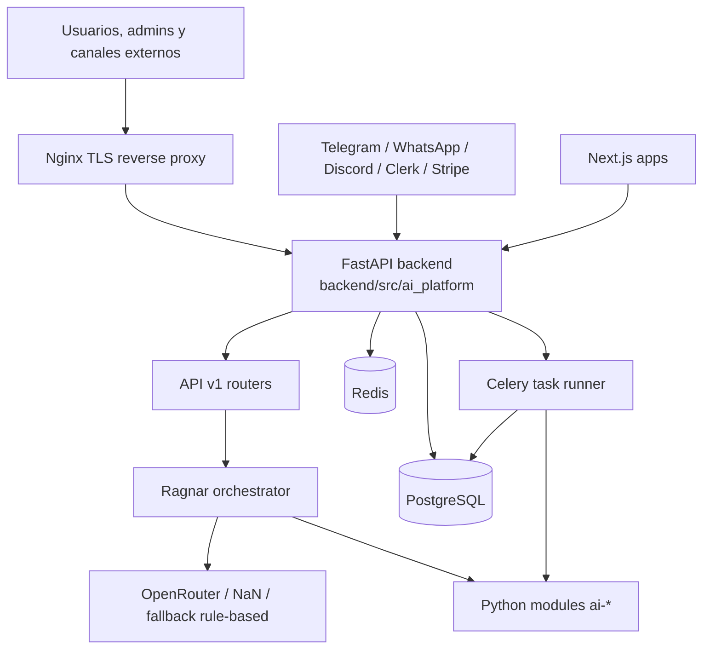

# AI Platform Architecture

Estado del documento: 2026-05-20
Referencia de revisión local: `61978ae`

## Resumen

AI Platform es hoy un monorepo híbrido:

- El núcleo operativo está en `backend/src/ai_platform`: FastAPI, SQLAlchemy, Alembic, Ragnar, webhooks, canales, módulos Python y worker Celery.
- El workspace TypeScript con pnpm y Turborepo contiene apps Next.js, paquetes compartidos, servicios y workers scaffold.
- La infraestructura de producción está orientada a un contenedor Python detrás de Nginx, con PostgreSQL y Redis en red privada.

La arquitectura objetivo sigue siendo `modular monolith + orchestrator + workers`, pero el estado real del código no es todavía una plataforma distribuida completa. Varias piezas del monorepo TypeScript son placeholders o prototipos.

## Topología Actual

## Capas

### Backend Python

`backend/src/ai_platform` es la parte más completa del producto.

- `main.py`: crea la aplicación FastAPI, registra routers, configura CORS local, agrega logging middleware y arranca `CronManager` en startup.
- `api/v1`: expone ping, health, tenants, tasks, Ragnar y webhooks.
- `models/db.py`: define `Tenant`, `User`, `Task`, `UsageEvent`, `AgentMemory`, `Session` y `Message`.
- `database.py`: configura SQLAlchemy síncrono y sesiones.
- `core/config.py`: centraliza settings con Pydantic.
- `orchestrator`: contiene Ragnar, cliente LLM, memoria, sesiones, knowledge base, rate limits, pricing, plugins, subagentes, skills y observabilidad.
- `modules`: contiene handlers Python para `ai-connect`, `ai-web`, `ai-content`, `ai-social`, `ai-leads`, `ai-ads` y `ai-analytics`.
- `channels`: adaptadores para Telegram, WhatsApp y Discord.
- `workers/task_runner.py`: worker Celery que ejecuta módulos dinámicamente y registra estado/usage.

### API

Rutas principales bajo `/api/v1`:

- `GET /ping`
- `GET /health`
- `POST /ragnar/decide`
- `POST /tasks`
- `GET /tasks`
- `GET /tasks/{task_id}`
- `PATCH /tasks/{task_id}`
- `DELETE /tasks/{task_id}`
- `GET /tenants/me`
- `POST /tenants`
- `POST /webhooks/clerk`
- `POST /webhooks/stripe`
- `POST /webhooks/telegram`
- `POST /webhooks/whatsapp`
- `POST /webhooks/discord`

No existe actualmente un endpoint `/api/v1/usage`, aunque el dashboard lo intenta consumir.

### Orquestador Ragnar

Ragnar decide y coordina tareas:

- evalúa señales de prompt injection;
- crea o recupera sesiones;
- carga memoria, knowledge base y contexto reciente;
- aplica hooks de plugins;
- selecciona modelo LLM;
- hace fallback rule-based si el proveedor falla;
- decide módulo, acción, parámetros y necesidad de subagentes;
- registra trayectoria, métricas y eventos de memoria.

Limitación actual importante: `Ragnar._invoke_module()` todavía devuelve un placeholder. El worker Celery sí intenta importar handlers reales, pero el flujo directo de Ragnar no ejecuta todavía los módulos de negocio de forma productiva.

### Módulos De Negocio

Los módulos existen en dos formas:

- `backend/src/ai_platform/modules/ai_*`: módulos Python usados por backend y worker.
- `modules/ai-*`: scaffolds de dominio documentales con estructura `application`, `domain`, `infrastructure`, `contracts`, `prompts`, `tools` y `tests`.

Estado actual:

| Módulo | Estado |
| --- | --- |
| `ai-connect` | Handler Python con validaciones y respuestas stub para WhatsApp, llamadas, chat, agenda y contactos. |
| `ai-web` | Handler stub. |
| `ai-content` | Handler stub. |
| `ai-social` | Handler stub. |
| `ai-leads` | Handler stub. |
| `ai-ads` | Handler stub. |
| `ai-analytics` | Handler stub. |

### Frontend Y Workspace TypeScript

El workspace pnpm incluye:

- `apps/dashboard`: app Next.js con una página dashboard que consume tareas desde `http://localhost:4000/api/v1/tasks` y un endpoint de usage que aún no existe.
- `apps/admin`: placeholder Next.js.
- `apps/website`: placeholder Next.js.
- `packages/shared-types`, `shared-schemas`, `shared-prompts`, `ui-kit`, `sdk`: paquetes compartidos mínimos.
- `services/api-gateway`: servicio Fastify mínimo con `/health` y `/api/v1/ping`.
- `services/orchestrator`: configuración y Dockerfile, sin runtime TS equivalente al Ragnar Python.
- `workers/scheduler` y `workers/task-runner`: workers TS mínimos que devuelven estado ready.

El backend productivo no depende hoy del `services/api-gateway` TS. En producción, Nginx enruta directamente al contenedor Python.

### Datos

Persistencia principal:

- PostgreSQL para tenants, usuarios, tareas, eventos de uso, memoria, sesiones y mensajes.
- Redis para infraestructura async/cache.

Migraciones:

- Ruta canónica usada por el Dockerfile actual: `backend/migrations/alembic`.
- También existe `backend/alembic`, con una migración inicial alternativa que incluye `channel_mappings`.

Riesgo actual: el código de webhooks y `models/channel_mapping.py` usa SQL directo contra `channel_mappings`, pero esa tabla no está en el modelo SQLAlchemy principal ni en la ruta canónica `backend/migrations/alembic`. Esta divergencia debe resolverse antes de confiar en canales en producción.

### Seguridad, Auth Y Billing

Estado actual:

- `SECRET_KEY` es obligatorio en producción.
- Clerk tiene webhook para creación/actualización de usuarios.
- Stripe tiene webhook y servicio de billing parcial.
- Nginx aplica TLS, headers de seguridad, rate limits y bloqueo de dotfiles.
- La DB y Redis en producción quedan expuestos solo en localhost o red privada Docker.

Pendientes relevantes:

- La verificación Stripe en `services/billing_service.py` contiene TODOs.
- `WHATSAPP_APP_SECRET` se usa en el adaptador WhatsApp, pero no aparece en `Settings`.
- `CORS_ORIGINS` está definido en Docker Compose de producción, pero FastAPI usa una lista hardcodeada de localhost.

### Infraestructura

Infra local:

- `infra/compose/docker-compose.dev.yml`: PostgreSQL 16 y Redis 7 expuestos para desarrollo local.

Infra producción:

- `infra/docker/Dockerfile`: imagen Python del backend.
- `infra/docker/docker-compose.prod.yml`: app, Postgres, Redis y Nginx.
- `infra/docker/nginx/nginx.conf.template`: reverse proxy TLS con HTTP/2, rate limits y headers.
- `infra/docker/.env.example`: variables de despliegue productivo.

Advertencia: algunos scripts de despliegue todavía validan `http://localhost:4000` o `http://<VPS>:4000`, pero el compose productivo actual no publica el puerto 4000 del backend. El health público debe pasar por Nginx.

### CI Y Observabilidad

CI activo:

- `.github/workflows/ci.yml`
- Ejecuta lint/format Ruff, tests Python con PostgreSQL, typecheck deshabilitado para código legacy y build/push de imagen GHCR en `main`.

CI adicional no activo directamente:

- `infra/ci/github-actions/ci.yml` contiene una validación TypeScript/pnpm histórica.

Observabilidad:

- `observability/prometheus/prometheus.yml`
- `observability/loki/loki-config.yml`
- `observability/grafana/provisioning`

Riesgo actual: Prometheus todavía apunta a `api-gateway:4000`, lo cual no refleja el despliegue Python + Nginx actual.

## Contratos Arquitectónicos Vigentes

- Las APIs nuevas deben vivir bajo `/api/v1`.
- Las entidades persistentes de negocio deben incluir `tenant_id` cuando correspondan.
- Los módulos `ai-*` deben mantener límites de dominio claros aunque compartan runtime.
- El backend Python es la fuente de verdad para ejecución actual.
- La extracción a microservicios debe esperar evidencia de carga, despliegue independiente o aislamiento de fallos.

## Brechas Principales

1. Alinear `channel_mappings` entre modelos, migraciones y webhooks.
2. Conectar `Ragnar._invoke_module()` con handlers reales o eliminar el camino placeholder.
3. Corregir la diferencia entre el endpoint `/api/v1/usage` esperado por dashboard y la API real.
4. Hacer que CORS lea configuración de entorno en vez de valores locales hardcodeados.
5. Agregar `WHATSAPP_APP_SECRET` a settings/env o eliminar su uso.
6. Actualizar scripts de despliegue y Prometheus para la topología Nginx + backend actual.
7. Decidir si los servicios/workers TypeScript siguen como roadmap o deben reducirse para evitar ambigüedad.
