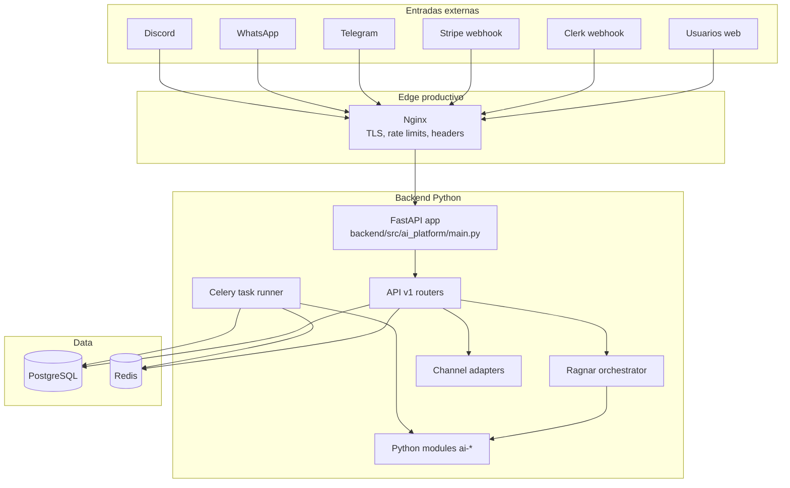
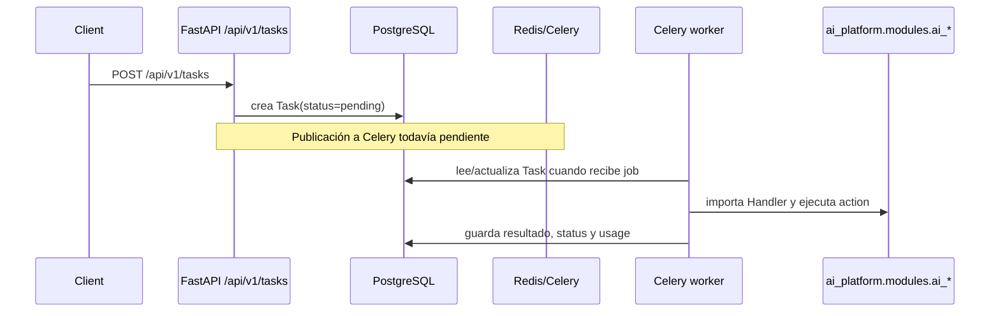
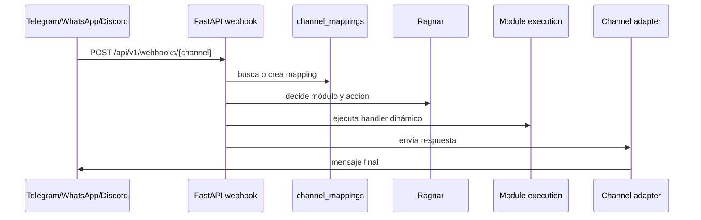

# Diagrama De Estructura Fase 1

Estado del documento: 2026-05-20

## Vista De Runtime Actual



## Vista De Monorepo

```text
AI-Platform/
├── apps/
│   ├── admin/                 # Next.js placeholder
│   ├── dashboard/             # Next.js prototype; consume API local
│   └── website/               # Next.js placeholder
├── backend/
│   ├── src/ai_platform/
│   │   ├── api/v1/            # FastAPI routers
│   │   ├── channels/          # Telegram, WhatsApp, Discord
│   │   ├── core/              # Settings y seguridad
│   │   ├── models/            # SQLAlchemy y channel mappings SQL
│   │   ├── modules/           # Handlers Python ai_*
│   │   ├── orchestrator/      # Ragnar y subsistemas
│   │   ├── services/          # Billing y servicios internos
│   │   └── workers/           # Celery task runner
│   ├── tests/                 # Pytest backend
│   ├── alembic/               # Árbol Alembic usado por migrate.py
│   └── migrations/alembic/    # Árbol Alembic copiado por Dockerfile
├── docs/
│   ├── adr/
│   ├── diagrams/
│   ├── reports/
│   └── runbooks/
├── infra/
│   ├── compose/               # Docker Compose local Postgres/Redis
│   ├── docker/                # Dockerfile, compose prod, Nginx
│   └── ci/                    # CI histórico TS
├── modules/
│   └── ai-*/                  # Scaffolds de dominio
├── observability/
│   ├── prometheus/
│   ├── loki/
│   └── grafana/
├── packages/
│   ├── sdk/
│   ├── shared-prompts/
│   ├── shared-schemas/
│   ├── shared-types/
│   └── ui-kit/
├── services/
│   ├── api-gateway/           # Fastify mínimo
│   └── orchestrator/          # Configuración, sin runtime TS principal
└── workers/
    ├── scheduler/             # Worker TS mínimo
    └── task-runner/           # Worker TS mínimo
```

## Flujo De Una Tarea API



## Flujo De Canales



Riesgo: el flujo depende de `channel_mappings`, pero esa tabla no está alineada entre modelos y migraciones canónicas.

## Estado Por Bloque

| Bloque | Estado actual |
| --- | --- |
| Backend FastAPI | Implementado y es el runtime principal. |
| Ragnar | Implementado para decisión, contexto y fallback; ejecución directa de módulo sigue placeholder. |
| Worker Celery | Implementado parcialmente; no está conectado desde `POST /tasks`. |
| Módulos Python | `ai-connect` tiene más lógica; el resto son stubs. |
| Apps Next.js | Dashboard prototipo; admin y website placeholders. |
| Services TS | Scaffolds mínimos, no son el runtime productivo. |
| Infra Docker prod | App Python + Postgres + Redis + Nginx. |
| Observabilidad | Configuración base, con target Prometheus desactualizado. |
